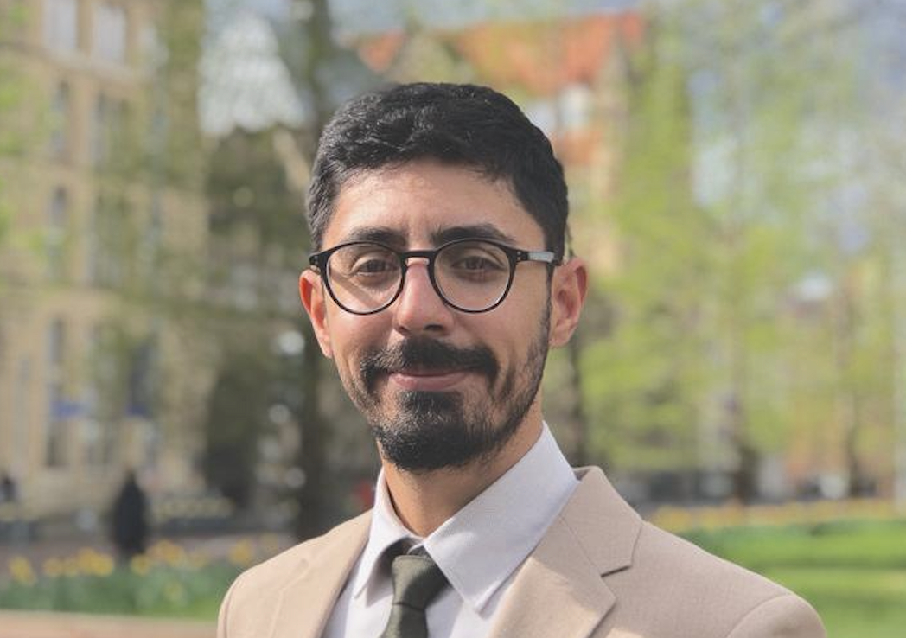

<head><link rel="stylesheet" href="https://cdnjs.cloudflare.com/ajax/libs/font-awesome/5.15.4/css/all.min.css"></head>

{width="350"}

 

I am an Assistant Professor in the Department of Neuroscience at the
Izmir Institute of Technology, Turkey. As a neuroscientist with a focus
on sleep and circadian biology, my research explores how biological,
environmental, and social factors influence biological rhythms across
the lifespan—from development to aging. I am particularly interested in
understanding the impact of light exposure in real-world environments,
aiming to uncover its role in shaping our circadian health and
well-being.

 

**Education and Experience**

-   Izmir Institute of Technology \| Turkey

Head of Department of Neuroscience \| (2024-present)

-   Izmir Institute of Technology \| Turkey

Assistant Professor \| (2023-present)

-   The University of Manchester \| UK

Postdoctoral researcher (2021-2023)

-   The University of Manchester \| UK

PhD in Neuroscience (2021)

-   King's College London \| UK

MSc in Neuroscience in Developmental Neurobiology (2017)

-   Istanbul Technical University \| Turkey

BSc in Molecular Biology and Genetics (2011)

 

 

**Connect with me:**

::: {style="display: flex; gap: 15px;"}
<a href="https://www.linkedin.com/in/altugdidikoglu" target="_blank" style="color: black;">
<i class="fab fa-linkedin fa-3x"></i> </a>

<a href="https://www.researchgate.net/profile/Altug-Didikoglu" target="_blank" style="color: black;">
<i class="fab fa-researchgate fa-3x"></i> </a>

<a href="https://x.com/altugdidikoglu" target="_blank" style="color: black;">

<a href="https://github.com/altugdidikoglu" target="_blank" style="color: black;">
<i class="fab fa-github fa-3x"></i> </a>
:::

*Contact*

Dr. Altug Didikoglu

Chronobiology Laboratory

Department of Neuroscience

IZTECH

Izmir, Turkey

altugdidikoglu (at) iyte.edu.tr
