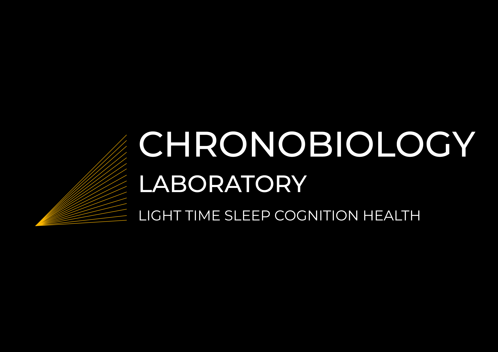

     

# What we do

Our research aims to understand the intricate relationships between light exposure, sleep, and cognition in both humans and animals. Our group is currently investigating the associations between sleep characteristics and aging, cognition, neurodegeneration, and mental health using statistical modelling in large cohorts. We are exploring biological factors (genetic, epigenetic, ageing), environmental factors (season, light), and social factors (occupation) that regulate biological rhythms in humans. The main research focus of our group is currently the influence of light exposure on sleep and cognition in humans. We are one of the leading research groups in the field, investigating this question in real-world settings. To conduct this research, we have developed a wearable light exposure monitor that measures melanopic lux, considered the gold standard for personal light exposure measurement. Additionally, for longitudinal collection of cognitive data in everyday life, we have created a mobile phone app that includes attention and memory tasks. Furthermore, we are exploring the reasons for individual differences in light sensitivities using pupillometry and psychophysics visual tasks. Most recently, our group has expanded its scope to include animal lighting for laboratory, farm animals, and pets. We aim to establish a new standard for measuring light for animals, taking into consideration their ocular anatomy and photoreceptor sensitivities.

     

# Team

 

## Postgraduate Students

- **Kubilay Can** 

- **Meric Celik** 

- **Sema Nur Aydin** 

- **Begum Ece Elcekin** 

 

## Undergraduate Research Students

- **Sena Gulsum** 

- **Zeynep Kayar** 

- **Burcu Gemici** 

- **Emin Bayindirli** 

- **Gokhan Karahanogullari** 

- **Cansu Ozkucukler** 

- **Eray Yildiz** 

- **Cengiz Akkus** 

- **Matin Huseynzade** 

 

## Alumni

-   **Esin Simge Guler**  previously: Undergraduate Research
    Student  now: Heidelberg University  [personal
    page](https://www.linkedin.com/in/esin-simge-g%C3%BCler-15593824b/)

-   **Halil Kaan Turk**  previously: Undergraduate Research
    Student  now: University of Tubingen  [personal
    page](https://www.linkedin.com/in/halil-kaan-t%C3%BCrk-33396a1b7/)

-   **Onur Bayram**  previously: Undergraduate Research Student 
    now: University of Vienna  [personal
    page](https://www.linkedin.com/in/obito/)

-   **Aleyna Nur Erim**  previously: Undergraduate Research
    Student  now: University of Helsinki  [personal
    page](https://www.linkedin.com/in/aleynanurerim/)

-   **Furkan Mert Kervan**  previously: Undergraduate Research
    Student  now: Izmir Institute of Technology  [personal
    page](https://www.linkedin.com/in/furkan-mert-kervan-b0020b199/)

 
