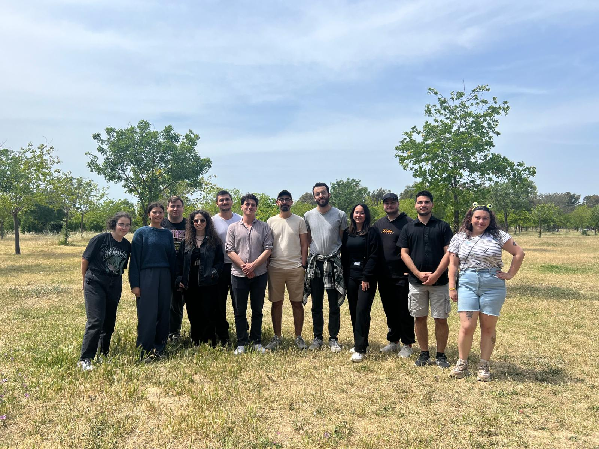
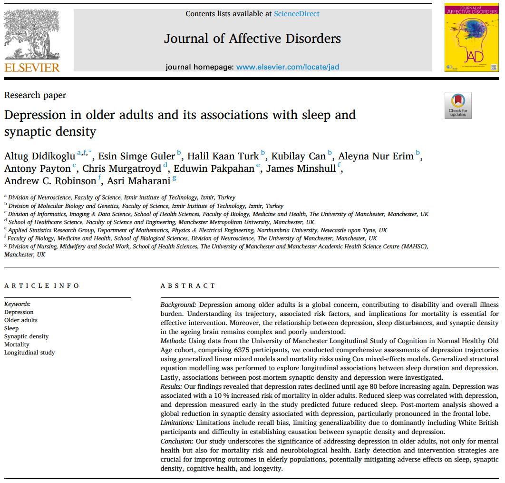

```{=html}
<script type='text/javascript' src='https://d1bxh8uas1mnw7.cloudfront.net/assets/embed.js'></script>
```
<hr>

# Chronobiology Lab Summer Picnic

*June 15, 2024*

Our Chronobiology Lab team recently had our first picnic together to
build better team spirit. It was a great chance to connect outside the
lab and strengthen our bonds. Although we know that some of our team
members might be moving on to new opportunities soon, the picnic served
as a reminder of how meaningful our time together is. Looking ahead, we
plan to make this picnic an annual tradition, a way to celebrate not
only our scientific achievements but also the friendships and
connections that make working in the Chronobiology Lab so rewarding.



<br> <br> <br> <br> <br>

<hr>

# Our First Lab Paper

*August 30, 2024*

#### Depression in Older Adults and Its Associations with Sleep and Synaptic Density

Depression in older adults is a pressing global concern, significantly
contributing to disability and the overall illness burden. Our recent
study, titled “Depression in Older Adults and Its Associations with
Sleep and Synaptic Density,” published in the Journal of Affective
Disorders, delves into the intricate relationships between depression,
sleep patterns, and synaptic density in the aging brain. You can access
the full paper [here](https://doi.org/10.1016/j.jad.2024.08.186).

**Key Highlights**

-   **U-Shaped Depression Trajectories:** Depression rates in older
    adults exhibit a U-shaped pattern, with rates declining until age 80
    before rising again.

-   **Increased Mortality Risk:** Older individuals with depression face
    a 10% increased risk of mortality.

-   **Reduction in Synaptic Density:** Depression correlates with a
    global reduction in synaptic density, particularly evident in the
    frontal lobe.

Our study underscores the significance of addressing depression in older
adults, not only for mental health but also for mortality risk and
neurobiological health. Early detection and intervention strategies are
crucial forimproving outcomes in elderly populations, potentially
mitigating adverse effects on sleep, synaptic density, cognitive health,
and longevity.

This research was conducted in collaboration with the Manchester Brain
Bank at The University of Manchester, with contributions from three of
our undergraduate lab members from the Izmir Institute of Technology.

::: {.altmetric-embed data-badge-type="medium-donut" data-badge-details="right" data-doi="10.1016/j.jad.2024.08.186"}
:::



<br> <br> <br> <br> <br>

<hr>
